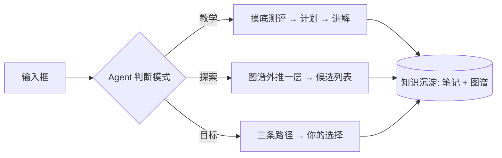

# 欢迎使用 LearnAgent

这是一个**基于 Markdown 编辑器的学习工作台**：AI 助手以私人教师的方式陪你学习，所有产出（讲解、探索候选、学习路径、知识沉淀）都以笔记形式直接写入这个知识库。

## 怎么用

1. **左下角输入框**是与 AI 交流的唯一入口，没有单独的聊天窗口——它的回答会变成编辑器里的笔记；
2. 输入框旁可切换三种模式：
   - **教学**（默认）：说出想学的东西，助手会先摸底测评、再定制计划、逐步讲解；
   - **探索**：说"推荐我学点什么"，助手会基于知识图谱向外推一层，给出 3~5 个候选；
   - **目标**：说出一个目标（如"我想做出自己的网站"），助手会推演**最短 / 深度 / 广度**三条路径供你选择；
3. 左侧栏点击 **知识图谱** 图标可打开力导向图谱页：绿色=已掌握，琥珀=学习中，**灰色=最外圈待探索的前沿知识**（`知识图谱.json` 中 status=learnable 的节点），可自由拖拽、缩放；
4. 每当你掌握一个知识点，助手会自动把它写成笔记、更新 `知识图谱.json`，并向外推演出一圈新的灰色候选。

## 编辑器支持

数学公式：质能方程 $E = mc^2$，以及独立公式：

$$
\int_{-\infty}^{\infty} e^{-x^2}\,dx = \sqrt{\pi}
$$

Mermaid 图表：

> 图注：三种模式殊途同归——所有学习成果都会沉淀为笔记和知识图谱。

试试在下面的输入框里输入"推荐我学点什么"吧。
