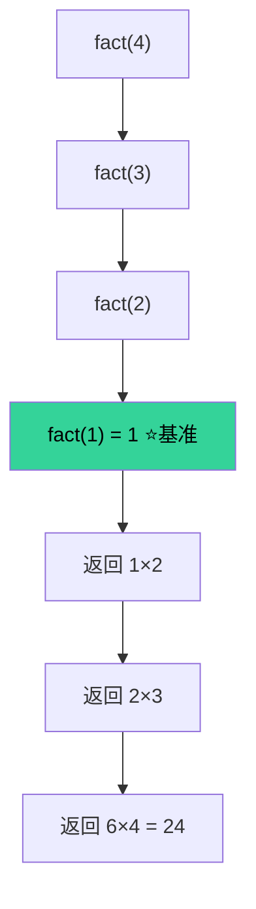

---
tags:
  - 算法
mastery: 7
status: mastered
date: 2026-08-20
id: recursion
related:
  - "[[函数与作用域]]"
  - "[[记忆化搜索]]"
---

# 递归

## 一句话定义

递归是函数通过**调用自身**来解决规模更小的同类子问题，直到到达可直接求解的基准情形。

## 要点小结

* 每个递归函数必须有**基准情形**（base case），否则无限递归导致栈溢出；
* 每次递归调用都要**向基准情形推进**（问题规模缩小）；
* 递归 = 数学归纳法的程序化：先假设子问题可解，再构造原问题的解。

## 结构示意



> 图注：调用链一路下潜到基准情形 `fact(1)`，再逐层回乘。

## 数学表达

阶乘的递推关系：

$$
n! = \begin{cases} 1 & n \le 1 \\ n \cdot (n-1)! & n > 1 \end{cases}
$$

## 典型示例

```python
def fact(n):
    if n <= 1:        # 基准情形
        return 1
    return n * fact(n - 1)   # 向基准推进
```

## 我的易错点

* 忘写基准情形，或基准永远到达不了；
* 误以为递归"同时"展开——实际是先一路压栈、再逐层弹栈；
* 重复子问题多的递归（如朴素斐波那契）应转向 \[\[记忆化搜索]]。

