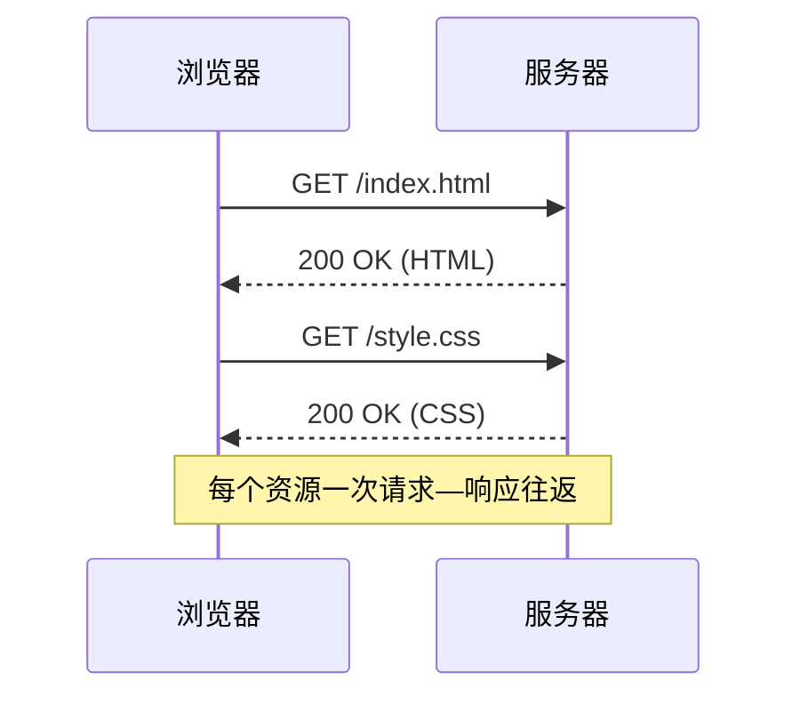

---
tags:
  - 计算机网络
mastery: 6
status: mastered
date: 2026-08-22
id: http-basics
related:
  - "[[HTTPS与TLS握手]]"
---

# HTTP 基础

## 一句话定义

HTTP 是浏览器与服务器之间"请求—响应"式的应用层文本协议。

## 要点小结

* 无状态：每个请求相互独立，状态靠 Cookie / Token 维持；
* 请求 = 方法（GET/POST/…）+ 路径 + 头部 + 可选正文；响应 = 状态码 + 头部 + 正文；
* 常见状态码：2xx 成功、3xx 重定向、4xx 客户端错误、5xx 服务端错误。

## 请求时序



> 图注：一次页面加载通常触发多次串行/并行的 HTTP 往返。

## 典型示例

```bash
curl -i https://example.com/
# HTTP/2 200
# content-type: text/html; charset=UTF-8
```

## 我的易错点

* 把 POST 想象成"幂等"操作——POST 默认不幂等，重复提交会重复创建；
* 4xx 与 5xx 归属搞反：4xx 是"你的问题"，5xx 是"服务器的问题"；
* 认为HTTP 首部大小写敏感——字段名实际不区分大小写。

